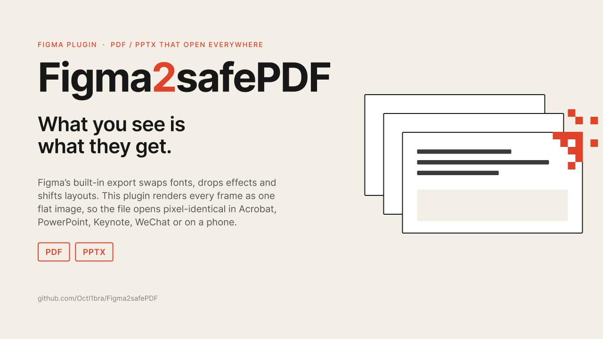

# Figma2safePDF



**English** · [中文](README.zh-CN.md)

Figma's built-in PDF and PPTX export is fragile: fonts get substituted, gradients and shadows break, layouts shift, and the files often open wrong in PowerPoint, Keynote, WeChat or on a phone. This plugin renders every frame or slide as one flat bitmap and packs those into a PDF or PPTX, so the file opens exactly like your canvas, everywhere. Side effect: there is no text layer and nothing editable.

- Works in Figma Design and Figma Slides
- Select nothing to export every top-level frame on the current page (sections are expanded); select frames to export only those
- Order: **Position** (row by row, left to right), **Layers** (layers-panel order), or **Number** (the first run of digits in each layer name: `03 Cover` → 3, unnumbered frames go last). Slides always use the presentation order
- Scale presets 1x–4x or any custom multiplier (0.1–10); PNG or JPG
- Output PDF **or** PPTX. PDF pages take the size of their frames; PPTX slides follow the aspect ratio of the first frame and center the rest
- Fully offline. `networkAccess` is `none`; nothing leaves Figma

## Install (local development plugin)

```bash
pnpm install
pnpm build          # writes dist/code.js and dist/ui.html
```

Figma desktop app → **Plugins → Development → Import plugin from manifest…** → pick `manifest.json` in this folder. Then run it from Plugins → Development → Figma2safePDF (or search it with ⌘/).

`dist/` is committed, so cloning and importing the manifest works without Node.

## Develop

```bash
pnpm watch          # rebuild on change, then re-run the plugin in Figma
pnpm typecheck
pnpm smoke          # Node: synthesise PNGs, build a PDF and a PPTX, check page counts and sizes
pnpm harness        # then open http://localhost:8766/scripts/harness.html
```

The harness is a fake Figma main thread: it feeds canvas-rendered images into the real `dist/ui.html` so the UI can be exercised in a browser. Switch to a fresh port if Chrome starts blocking downloads for the origin.

```
manifest.json      plugin manifest (editorType figma + slides, dynamic-page, no network)
src/code.ts        main thread: collect nodes, order them, exportAsync one by one
src/ui.ts          iframe: pdf-lib builds the PDF, PptxGenJS builds the PPTX, trigger download
src/ui.html        UI markup and styles, modelled on Figma's own Export panel
build.mjs          esbuild: code.js bundled alone, ui.js bundled and inlined into ui.html
scripts/smoke.mjs  Node smoke test for the builders
scripts/harness.html  browser harness
assets/            Community icon and cover (cover.html renders the PNG with headless Chrome)
docs/community-listing.md  copy for the Figma Community publish dialog
```

## Known limits

- JPG uses Figma's own encoder, so quality is not adjustable. For smaller files use JPG plus a lower scale.
- Figma caps the size of a single export; very tall pages at 4x may fail. Failed pages are skipped and counted in the status line.
- PPTX has a single slide size, so frames with a different aspect ratio are letterboxed.

## License

MIT
